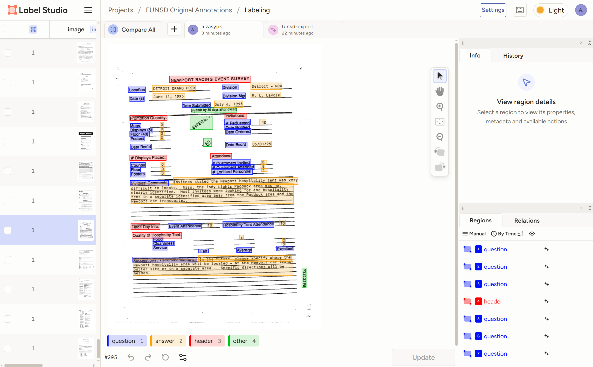
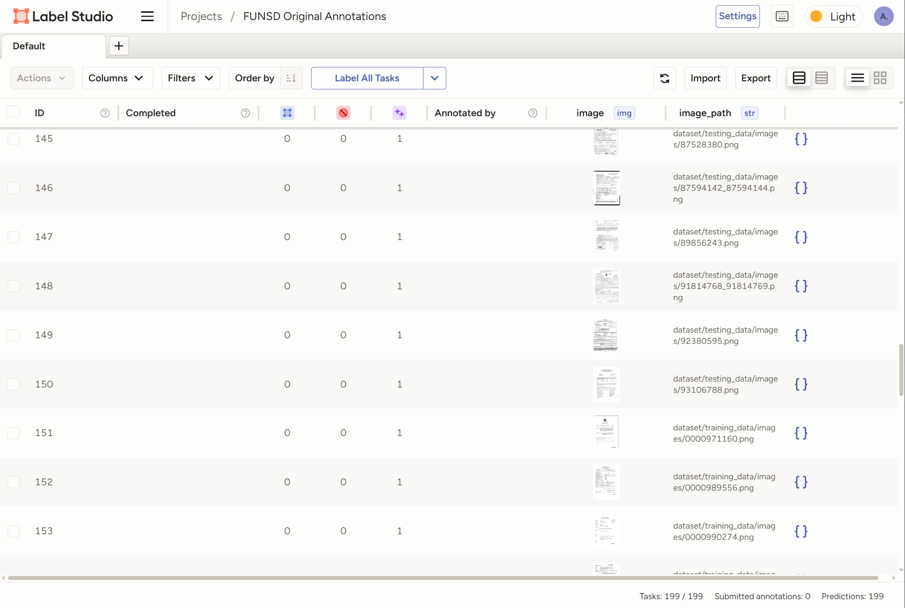
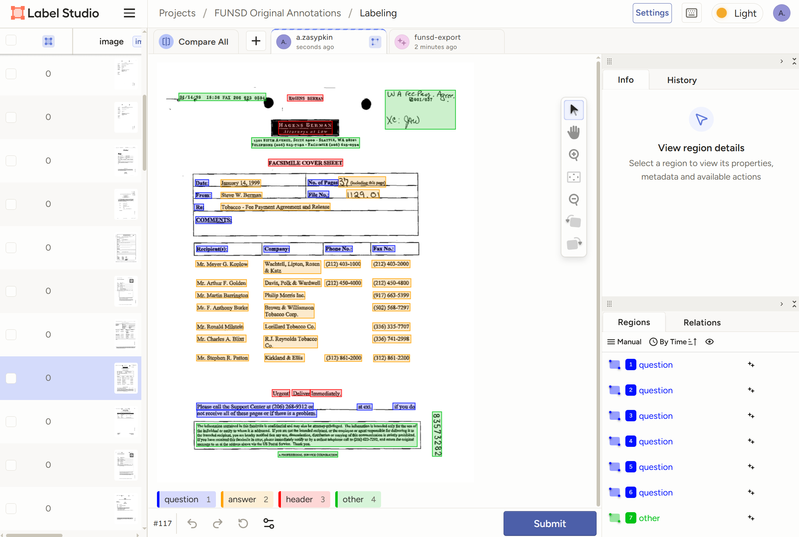

# Данные датасета FUNSD в формате Label Studio

Для загрузки официальной разметки [FUNSD](https://guillaumejaume.github.io/FUNSD/) в качестве предразметки LS:

1. Перед запуском Label Studio в терминале разрешите локальные файлы командой `export LABEL_STUDIO_LOCAL_FILES_SERVING_ENABLED=true`.
2. Укажите путь к корневой папке проекта: `export LABEL_STUDIO_LOCAL_FILES_DOCUMENT_ROOT=/absolute/path/to/your/data`.
3. Запустите LS, при создании нового проекта выберите шаблон интерфейса для классификации bounding box'ов. Добавьте классы *question*, *answer*, *header*, *other*.
4. Сохраните проект, выберите в **Source Storage** опцию **Local Files**. В пути к данным укажите путь до папки *datasets*.
5. В **Import Method** выберите **Files**.
6. Не нажимайте Sync, просто сохраните настройки.
7. В интерфейсе проекта нажмите **Import** и загрузите файлы *testing_annot* и *training_annot*.

---

